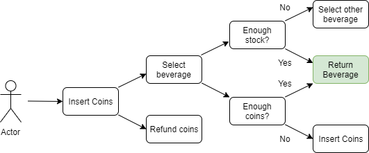

# Vending machine

This small APP handles the operation of a beverage vending machine.
This project has been developed for a Frontend technical assignment.

## Screenshoot

## Functional Description

This machine accepts only coins and lets you select one product at a time. When the user enter the app, he/she has different coins (2, 1, 0.5 and 0.2) and get what they want from the machine.

User insert coins and select the beverage and, if purchase can be satisfied because the machine has **enough coins** and **stock**, user gets the selected beverage. Otherwise, if there isn't enough stock or an unexpected error occurs, user cannot receive their purcharse and he/she will receive a **notify**.

If user inserts more coins than the value of the selected beverage, the machine will return **change** when delivering the product. If there isn't enough coins stock, user will receive maximum amount available and the machine will notify an ERROR.

The machine will **refill** their coins and beverage as soon as it notice that stock of any of the item is 0. Also, user can click on the **refund** button and receive the inserted coins, and can act like the technical service and refill coins and beverage by herself/himself.

### Diagram

## Technologies

The front-end is created using ReactJS with Hooks with "create-react-app". Styled with SCSS.
Also, a Reactjs libraries is used to create the notifications, as:

  "react-notifications-component"

### Components and Pages

- Components:
    - App
    - Coins
    - Notifications
    - RefillFunction
    - VendingMachine

## Author

[Silvia Barranco](https://github.com/sbarranco)
